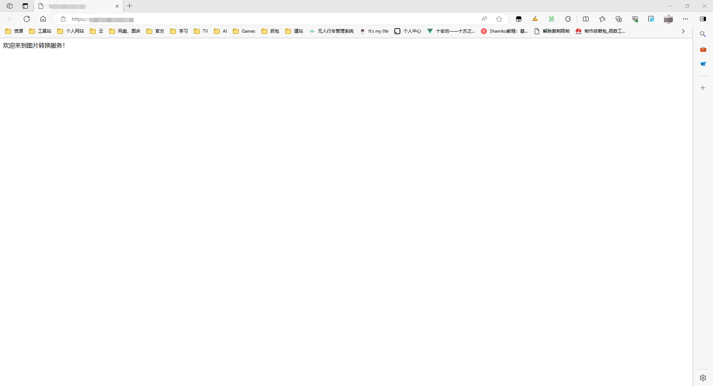
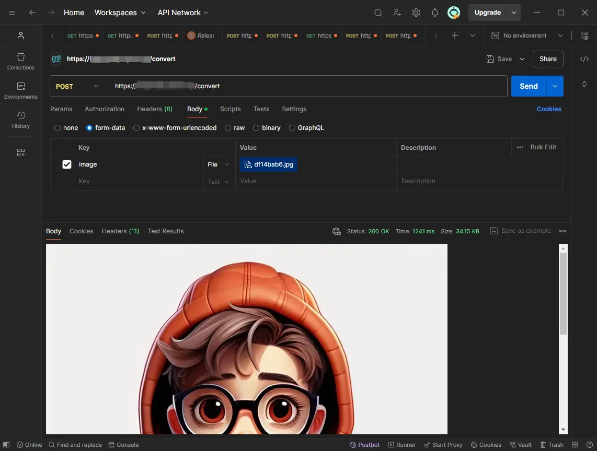

# img2webp项目介绍
## 项目简介
**Convert images to webp format using the Vercel API.**

img2webp是一个面向未来优化的Node.js微服务，致力于简化图像处理流程并加速网络内容交付。目前，它专注于在上传至各类存储平台前，自动将JPEG、PNG等图像格式高效转换为体积更小的WebP格式，显著提升网页与应用的加载速度。尽管当前版本侧重于标准化转换流程以保证最佳压缩效率，未来的迭代计划中将加入质量与尺寸的自定义配置，以及鉴权功能，以增强安全性和灵活性，满足更广泛的个性化需求。

## 使用方法
1. 先将此仓库进行 Fork（[分支](https://github.com/kyeo-hub/image2webp.git)）
2. 通过 Vercel 部署你的仓库
3. 将域名与 Vercel 的URL关联
4. 验证域名，打开浏览器进行验证项目部署是否成功！
    
5. 使用 Vercel 的URL上传图片以转换为 WebP 格式（使用postman验证项目是否生效！）
   

## 技术栈与部署
- 后端技术: 基于Node.js，确保高效、低延迟的图像转换处理。
- 部署方案: 无缝集成Vercel等现代云平台，享受全球部署与CDN加速。
## 当前核心功能
- 自动转换: 在上传流程中无缝集成，自动将图像转换为WebP格式。
- 性能优化: 利用WebP的先进压缩技术，减少文件大小而不损失视觉质量。
## 未来规划
- 灵活配置: 计划增加输出质量与尺寸的自定义选项，以适应多样化需求。
- 鉴权机制: 引入用户鉴权功能，防止服务滥用，保障系统稳定运行。
## 应用前景
- 加速Web开发: 适用于各种网站和Web应用，提升用户体验和SEO表现。
- 移动应用资源管理: 为APP的图像资源减负，提升加载速度，节省用户流量。
- 内容分发网络: 优化图像在CDN上的存储与传输效率，加速全球内容传播。
## 社区与贡献
- img2webp项目欢迎所有开发者参与共建。随着功能的不断丰富，我们期待您的宝贵意见、功能建议，以及代码贡献，共同推动项目向更加完善、安全的方向发展。